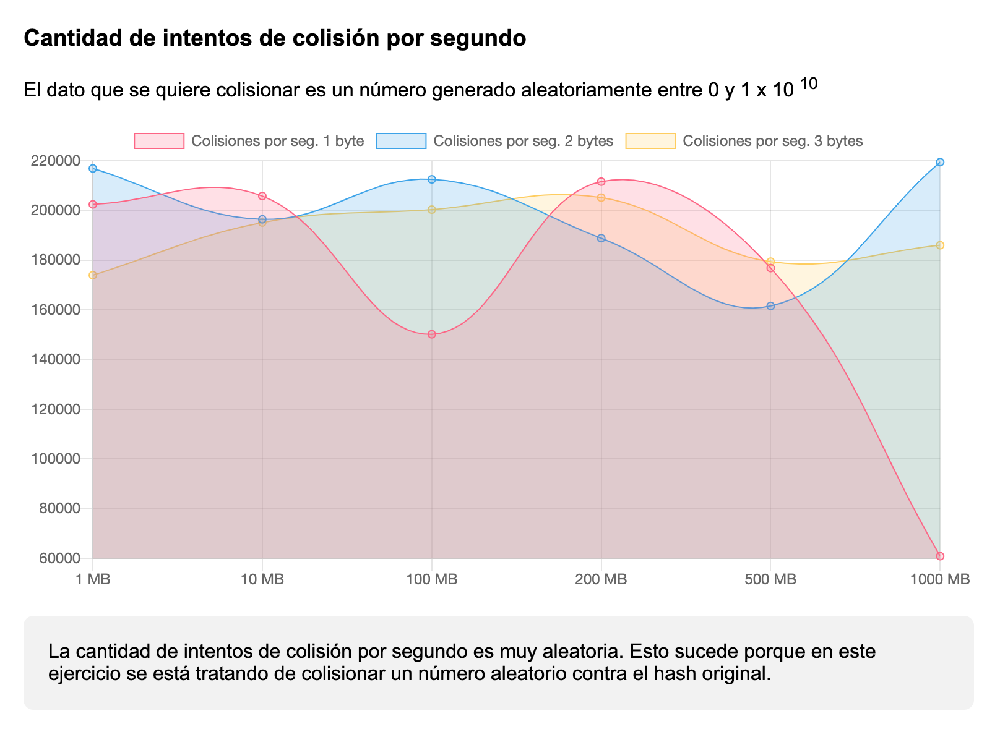

# Hash rate and hash collider report

[View Full Report »](https://lucasromerodb.github.io/hash-report/)



## What do you need?

You need at least Python 3.7.x installed https://www.python.org/downloads/

## How to run?

First you need to generate some dummy file/s. Run `data-gen.sh` file to generate 1 to 1000 MB of data inside `files/` folder.

> Default option is 1 MB file. Edit file to enable (uncomment) 10, 100, 200, 500, 1000 MB options

```bash
$ bash data-gen.sh
```

Then open any terminal on project folder and run the script

```bash
$ cd <PROJECT_FOLDER>
$ python3 main.py
```

> Built over Python 3.7.x and macOS, please comment if you need help or if you have some issues running the script.

### Recomended terminals:

- Git Bash (Windows) https://git-scm.com/downloads
- iTerm2 (macOS) https://www.iterm2.com/
- Terminator (Linux) https://launchpad.net/terminator
